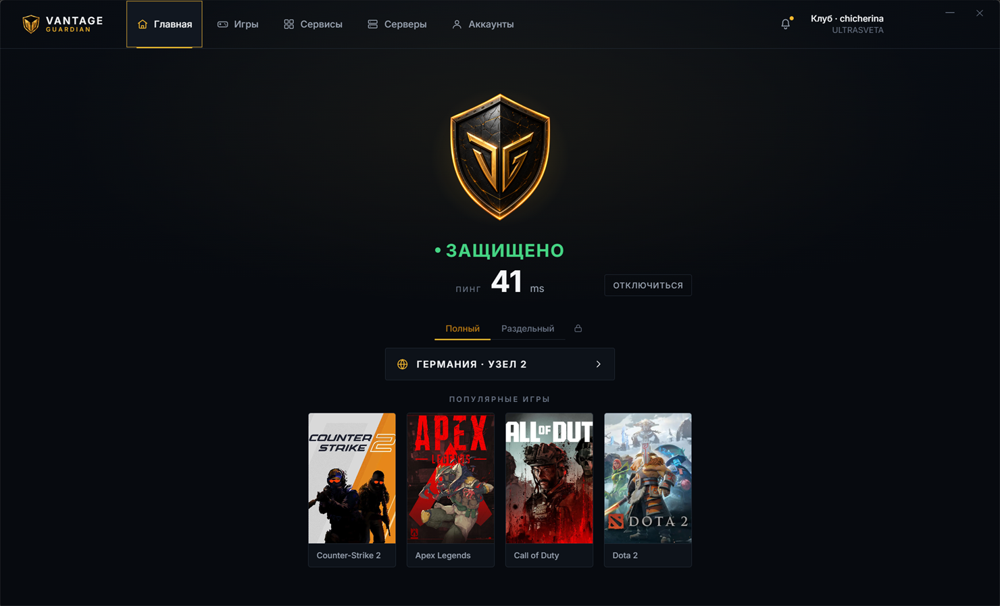
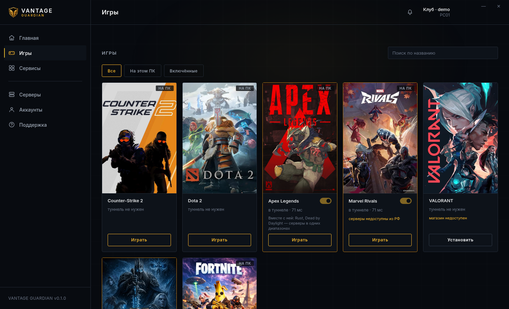
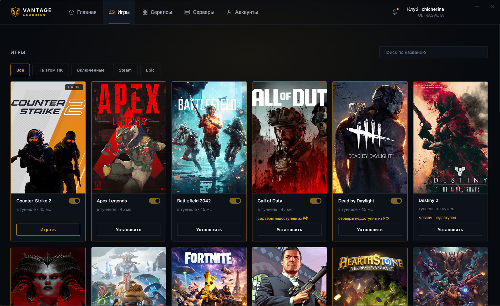
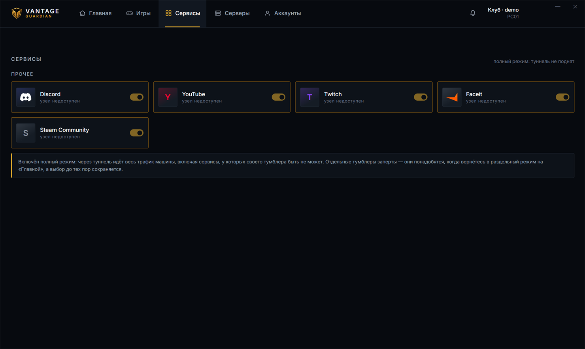
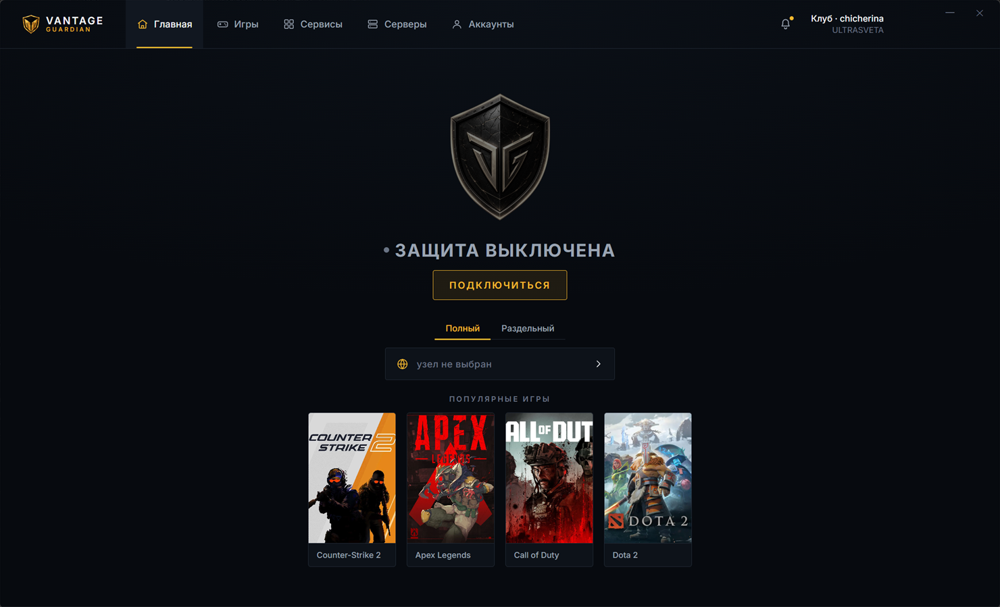

<h1 align="center">VANTAGE GUARDIAN</h1>

<p align="center">Сетевая защита для компьютерных клубов</p>

<p align="center"><a href="../../releases/latest"><b>СКАЧАТЬ ПОСЛЕДНЮЮ ВЕРСИЮ</b></a></p>



## Новый облик

С версии 0.4.0 у клиента второй дизайн. С главного экрана убрано всё, что не
отвечает на вопрос «защищён я сейчас или нет». Осталось три вещи: щит, кнопка
под ним и строка с узлом и задержкой.

- **щит вместо панели показателей** — состояние видно с одного взгляда, читать
  ничего не нужно;
- **разделы переехали в полосу сверху** — боковой панели больше нет, всё окно
  отдано экрану;
- **четыре игры на виду**, остальные — в разделе «Игры»;
- фон стал ровным, декоративная сетка снята.

<details>
<summary><b>Как выглядело до 0.4.0</b></summary>

Первый облик: боковая панель слева, ядро посреди окна, показатели вокруг него.
Снимки оставлены, чтобы было видно, что изменилось.





</details>

## Что делает клиент

Клиент поднимает защищённый туннель от машины клуба до игрового узла. Гость
нажимает одну кнопку — дальше всё делает страж.

- **задержка и потери видны сразу** — не «всё хорошо», а измеренные числа;
- **два режима**: в туннель уходят либо только выбранные игры и сервисы, либо
  весь трафик машины;
- **локальные сети клуба не трогаются никогда** — диск с играми, LANGAME и
  оборудование зала остаются в своей сети;
- **AmneziaWG** с шифрованием ChaCha20-Poly1305 и обфускацией.

## Игры

Клиент сам находит установленные игры в Steam, Epic Games, Battle.net, Riot,
EA и Ubisoft Connect — и запускает их прямо из окна.



Возле каждой игры видно, нужен ли ей туннель и что происходит с её серверами.

## Сервисы

Discord, Telegram, стримы, музыка, рабочие и ИИ-сервисы — по тумблеру на каждый.



Где раздельный режим сервис покрывает не целиком, об этом написано на самой
карточке: например, звонки Discord ходят по адресам, которые заворачивать
нечем, и для них нужен полный туннель.

## До подключения

Пока защита выключена, клиент так и говорит: трафик идёт напрямую.



## Установка

Подробно — в [УСТАНОВКА.md](УСТАНОВКА.md).

| Файл | Кому |
|---|---|
| `…-setup.exe` | установка на одну машину |
| `…_x64_en-US.msi` | тихая установка на зал |

Требуется Windows 10/11 x64 и права администратора: без них не создать сетевой
адаптер.

К каждому выпуску приложен `SHA256SUMS.txt` — проверьте загруженный файл:

```powershell
Get-FileHash .\vantage-guardian_0.4.0_x64-setup.exe -Algorithm SHA256 | Format-List
```

## Лицензия

Программа проприетарная, условия — в [LICENSE](LICENSE). Право использования
даётся по лицензионному ключу: ключ привязывается к установке при первой
проверке и на другой установке не работает.

## Поддержка

Вопросы по работе в зале — администратору клуба.

---

Исходный код закрыт. Здесь публикуются готовые сборки.
